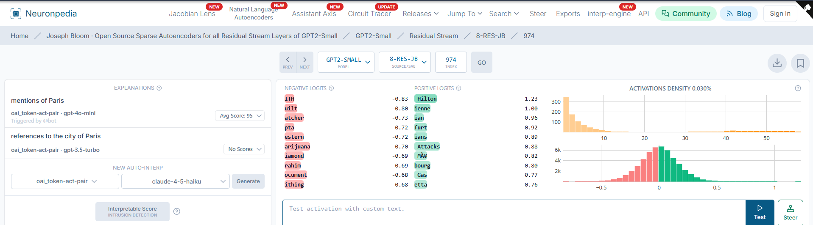

# Phase 1: Pretrained SAE Baseline — Observations

This phase investigates whether a pretrained Sparse Autoencoder (SAE) can identify interpretable features from GPT-2 Small's internal representations. The experiments use activations from `blocks.8.hook_resid_pre` and a pretrained SAE from the `gpt2-small-res-jb` release.

## Observation 1 — GPT-2 Activations Can Be Extracted for SAE Analysis

GPT-2 first tokenizes the input sentence into token IDs before processing it through the transformer. Using `run_with_cache()`, the model's internal residual-stream activations can be extracted at different transformer layers.

At `blocks.8.hook_resid_pre`, each token is represented by a 768-dimensional activation vector. These activations can then be passed to the pretrained SAE for feature-level analysis.

## Observation 2 — The SAE Produces a Sparse Feature Representation

The pretrained SAE accepts GPT-2's 768-dimensional residual-stream representation and encodes it into 24,576 possible SAE features.

Different tokens produced different numbers of positive feature activations. For the sentence "The Eiffel Tower is located in Paris.", for example, the `el` subtoken had 93 active features, `Tower` had 292, `located` had 550, and `Paris` had 1,561.

This shows that different token positions produce different SAE activation patterns. The SAE provides a feature-level representation that can be investigated to determine whether individual features correspond to interpretable concepts.

## Observation 3 — Feature 974 Strongly Activates for Paris

The SAE feature activations at the `Paris` token position were examined. Among the 24,576 possible SAE features, Feature 974 produced the strongest activation.

Feature 974 had an activation of approximately 57.53, while the second-highest feature had an activation of approximately 20.08.

This large difference identified Feature 974 as a candidate feature for further investigation. At this stage, however, a single high activation was not considered sufficient evidence that the feature specifically represented Paris.

## Observation 4 — Neuronpedia Independently Associates Feature 974 with Paris

Feature 974 was inspected using Neuronpedia for the GPT-2 Small `8-RES-JB` SAE. Neuronpedia's automated feature explanations describe Feature 974 as relating to "mentions of Paris" and "references to the city of Paris."

This independently supports the feature discovered in our experiment and provides additional evidence that Feature 974 captures Paris-related information.

## Observation 5 — Feature 974 Remains Strong Across Different Paris Contexts

Feature 974 was tested on multiple sentences containing Paris. The activation remained consistently high even when the surrounding context changed.

The observed activation scores were:

- "I traveled to Paris last summer." — 58.31
- "Paris is the capital of France." — 56.88
- "She moved to Paris for work." — 57.38
- "The conference will be held in Paris." — 58.14
- "We visited Paris during our vacation." — 64.16

The activations remained approximately between 57 and 64 despite the sentences representing different contexts such as travel, geography, work, conferences, and vacations.

The exact activation is not expected to remain identical because GPT-2 produces contextual representations. The internal representation of `Paris` changes depending on the surrounding words. Therefore, consistent strong activation across different contexts is more important than obtaining exactly the same activation value.

## Observation 6 — Matched Paris vs. London Comparison

To determine whether Feature 974 responds to Paris specifically or simply responds strongly to city names, a matched comparison was performed.

"I traveled to Paris last summer." produced a Feature 974 activation of approximately 58.31, while "I traveled to London last summer." produced an activation of approximately 6.67.

Because the surrounding sentence remained nearly identical and the primary change was `Paris` to `London`, this provides evidence that Feature 974 is not simply responding strongly to every city name.

## Observation 7 — Paris and Non-Paris Examples Show Strong Separation

Five Paris-containing sentences were compared with five sentences containing other cities.

The non-Paris examples produced the following Feature 974 activations:

- London — 6.67
- Berlin — 9.07
- Chicago — 3.10
- Tokyo — 8.45
- Rome — 7.24

The average Feature 974 activation for the Paris examples was 58.97, while the average activation for the non-Paris examples was 6.91.

Feature 974 therefore activated approximately 8.5 times more strongly on average for the tested Paris examples than for the tested non-Paris city examples.

This provides strong preliminary evidence that Feature 974 is selective for Paris-related representations rather than generic city-name information.

## Phase 1 Finding

The Phase 1 experiments provide consistent evidence that Feature 974 is strongly associated with Paris-related representations in GPT-2 Small.

Feature 974 was initially discovered as the strongest SAE feature at the `Paris` token position. Neuronpedia independently describes the same feature as responding to mentions or references to Paris. The feature also remained strongly active across multiple Paris contexts while producing substantially weaker activations for other tested cities.

These results provide evidence of representational selectivity. However, the current experiment uses a relatively small set of examples, so the results should not yet be interpreted as proof that Feature 974 exclusively represents Paris.

